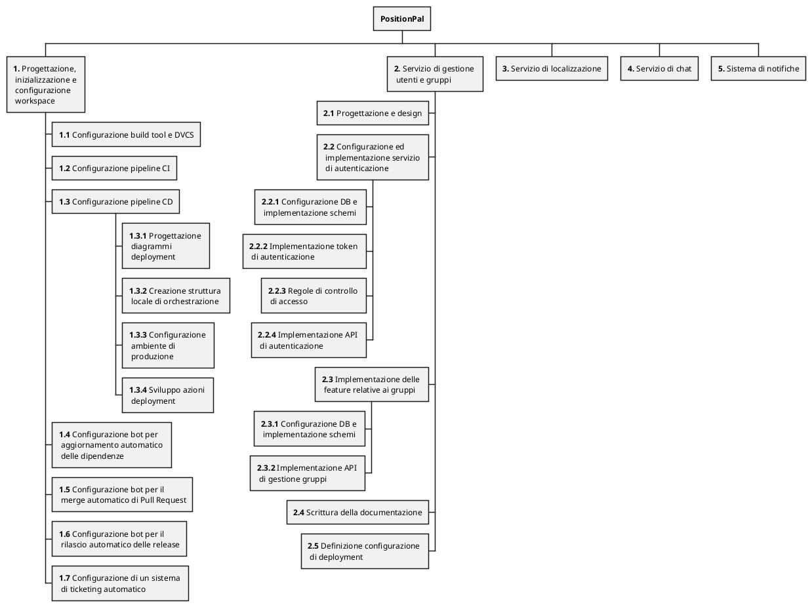

## Event Storming

> **🚧 TODO: Riportare diagramma _event storming_**
{: .block-warning }

## Work Breakdown Structure

Vengono qui di seguito esplosi i requisiti del sistema, a partire dagli obiettivi definiti nel [POS]({{ site.baseurl }}/attachments/1-pos/) e sulla base dell'_Event Storming_ effettuato , nel formato di una _Requirements Breakdown Structure_.

> ℹ️ **_Info_**
> Di seguito è riportata una versione testuale dello schema.
{: .block-tip }

1. **Progettazione, inizializzazione e configurazione dei workspace con un adeguato _build tool_, di un'infrastruttura con predisposizione a una _pipeline_ automatizzata di _continuous integration & deployment_.**
   1. Configurazione build tool e DVCS
   2. Configurazione pipeline di _continuous integration_
   3. Configurazione pipeline di _continuous deployment_
      1. Progettazione diagrammi deployment
      2. Creazione struttura locale minimale di orchestrazione
      3. Configurazione ambiente di produzione
      4. Sviluppo azioni deployment da locale a produzione
   4. Configurazione _bot_ per aggiornamento automatico delle dipendenze
   5. Configurazione _bot_ per il _merge_ automatizzato di Pull Request sulla repo
   6. Configurazione _bot_ per il rilascio automatico delle _release_
   7. Configurazione di un sistema di _ticketing_ automatizzato

2. **Progettazione e implementazione di un servizio per la gestione utente che deve occuparsi di tutti gli aspetti relativi all'autenticazione, sia per quanto riguarda l'iscrizione, sia per il log-in, a cui va aggiunta la creazione e il mantenimento dei gruppi.**
   1. Progettazione e design
   2. Configurazione ed implementazione servizio di autenticazione
      1. Configurazione DB e implementazione schemi
      2. Implementazione token di autenticazione
      3. Regole di controllo di accesso
      4. Implementazione API di autenticazione
   3. Implementazione delle feature relative ai gruppi
      1. Configurazione DB e implementazione schemi
      2. Implementazione API di gestione gruppi
   4. Scrittura della documentazione
   5. Definizione configurazione di deployment

3. **Progettazione e implementazione di un servizio di localizzazione che permetta di geolocalizzare un utente in tempo reale, individuare coordinate a partire da indirizzi / luoghi ed esporre un'API per impostare notifiche quando l'utente arriva in prossimità di una certa posizione.**
   1. Confronto di tecnologie _MOM_ consone allo sviluppo del servizio
   2. Progettazione e design
   3. _Geocoding_ di indirizzi / luoghi in coordinate
      1. Studio di un servizio web di mappe per il _geocoding_
      2. Implementazione logica
   4. Implementazione API del servizio
      1. Impostazione di notifiche di prossimità
      2. Tracciamento real-time e gestione della posizione
      3. Configurazione DB dati e implementazione schemi
      4. Gestione stato utente
      5. Configurazione tecnologia / protocollo scelto all'interno del sistema
   5. Scrittura della documentazione
   6. Definizione configurazione di deployment

4. **Progettazione e implementazione di un servizio di chat che permetta di conversare in tempo reale con un singolo o un gruppo ristretto di utenti con la quale si vuole condividere la propria posizione e stato. Questo permetterà all,'utente di avere una comunicazione più diretta e immediata con i membri del gruppo.**
   1. Analisi di tecnologie / protocolli per lo scambio di messaggi
   2. Analisi aspetti di _sicurezza_ nella comunicazione in tempo reale tra più utenti
      1. Implementazione servizio _crittografia E2E_
   3. Implementazione API del servizio
      1. Configurazione tecnologia / protocollo scelto all'interno del sistema
      2. Implementazione funzionalità di chat
         1. Gestione invio _notifiche_
      3. Implementazione funzionalità _amministrazione_ dei gruppi chat
   4. Scrittura della documentazione
   5. Definizione configurazione di deployment

5. **Sistema di notifiche**
   1. Analisi di tecnologie / protocolli per l'invio di notifiche push
   2. Implementazione API del servizio
      1. Implementazione DB e schemi
      2. Implementazione funzionalità di invio notifiche push
      3. Implementazione funzionalità di invio notifiche mail
   3. Scrittura della documentazione
   4. Definizione configurazione di deployment

<!--
   1. Autenticazione
      1. Iscrizione
         1. il servizio deve supportare l'iscrizione di nuovi utenti
         2. il servizio deve inviare una mail con i dati relativi all'iscrizione
      2. Log-in
         1. il servizio deve supportare il _login_ di utenti già iscritti
         2. il servizio deve creare e gestire _token_ di autenticazione e la sessione a questo correlata
      3. Aggiornamento utente
         1. il servizio deve permettere all'utente di modificare le proprie informazioni e password
   2. Gestione gruppi
      1. Creazione gruppo
         1. il servizio deve supportare la creazione di un gruppo
      2. Adesione gruppo
         1. il servizio deve supportare la possibilità di invitare utenti nei gruppi, oltre che notificare i facenti parte del gruppo ad ogni nuova adesione
      3. Abbandono gruppo
         1. il servizio deve permettere all'utente di abbandonare un gruppo in cui ha precedentemente aderito
-->
