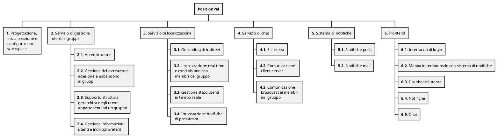

## Event Storming

Viene qui presentata la mappa concettuale dell'_Event Storming_ effettuato per la definizione dei requisiti del sistema.

## Requirements Breakdown Structure

Vengono qui di seguito esplosi i requisiti del sistema, a partire dagli obiettivi definiti nel [POS]({{ site.baseurl }}/attachments/1-pos/) e sulla base dell'_Event Storming_ effettuato, nel formato di una _Requirements Breakdown Structure_.

1. **Progettazione, inizializzazione e configurazione dei workspace con un adeguato _build tool_, di un'infrastruttura con predisposizione a una _pipeline_ automatizzata di _continuous integration & deployment_.**

2. **Progettazione e implementazione di un servizio per la gestione utente.**
   1. Il sistema deve poter gestire l'autenticazione degli utenti;
   2. Il sistema deve poter gestire la creazione, adesione e abbandono ai gruppi (operazioni CRUD);
   3. Il sistema deve supportare una struttura gerarchica degli utenti appartenenti ad un gruppo;
   4. Il sistema deve poter gestire le informazioni relative agli utenti e l'impostazione degli indirizzi preferiti.

3. **Progettazione e implementazione di un servizio di localizzazione.**
   1. Il sistema deve effettuare il _geocoding_ di indirizzi / luoghi in coordinate;
   2. Il sistema deve localizzare in tempo reale gli utenti e supportarne la condivisione con i membri del proprio gruppo;
   3. Il sistema deve gestire lo stato degli utenti in tempo reale;
   4. Il sistema deve permettere all'utente d'iniziare un percorso e condividerlo con i membri del proprio gruppo, notificando l'arrivo in prossimità della posizione di destinazione o in caso si verifichino situazioni anomale, quali l'utente rimane fermo per troppo tempo, va _off-line_ o non ha raggiunto la destinazione entro un certo tempo (stabilito all'atto della creazione del percorso);
   5. Il sistema, al sollevarsi di una situazione di pericolo, deve mantenere uno storico del percorso compiuto fino alla cessazione del pericolo.

4. **Progettazione e implementazione di un servizio di chat.**
   1. Il sistema deve permettere una comunicazione sicura;
   2. Il sistema deve permettere un canale di comunicazione tra il client e il server;
   3. Il sistema deve permettere una comunicazione (di messaggi testuali) di natura broadcast ai membri appartenenti ai gruppi.

5. **Sistema di notifiche**
   1. Il sistema deve permettere l'invio di notifiche push;
   2. Il sistema deve permettere l'invio di notifiche mail.

6. **Frontend**
   1. Il sistema deve permettere di registrarsi e autenticarsi al sistema
   2. Il sistema deve mostrare all'utente la mappa in tempo reale e lo stato di tutti i gruppi di cui fa parte.
   3. Il sistema deve permettere la modifica delle informazioni dell'utente
   4. Il sistema deve permettere di visualizzare le notifiche ricevute
   5. Il sistema deve permettere di visualizzare e interagire con le chat

