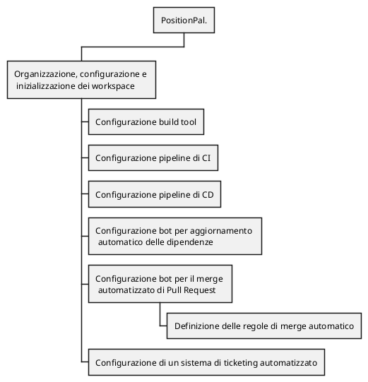

> **🚧 TODO: Riportare diagramma _event storming_**
{: .block-warning }

Vengono qui di seguito esplosi i requisiti del sistema, a partire dagli obiettivi definiti nel [POS](/PM-report/attachments/1-pos/).

1. **Organizzazione, configurazione e inizializzazione dei workspace con un adeguato _build tool_, di un'infrastruttura con predisposizione a una _pipeline_ automatizzata di _continuous integration & deployment_.**
   1. Configurazione build tool e DVCS
   2. Configurazione pipeline di _continuous integration_
   3. Configurazione pipeline di _continuous deployment_
   4. Configurazione _bot_ per aggiornamento automatico delle dipendenze
   5. Configurazione _bot_ per il _merge_ automatizzato di Pull Request sulla repo
      1. definizione delle regole di merge automatico
   6. Configurazione di un sistema di _ticketing_ automatizzato

2. **Progettazione e implementazione di un servizio per la gestione utente che deve occuparsi di tutti gli aspetti relativi all'autenticazione, sia per quanto riguarda l'iscrizione, sia per il log-in, a cui va aggiunta la creazione e il mantenimento dei gruppi.**
   1. Autenticazione
      1. Iscrizione
         1. il servizio deve supportare l'iscrizione di nuovi utenti
         2. il servizio deve inviare una mail con i dati relativi all'iscrizione
      2. Log-in
         1. il servizio deve supportare il _login_ di utenti già iscritti
         2. il servizio deve creare e gestire _token_ di autenticazione e la sessione a questo correlata
      3. Aggiornamento utente
         1. il servizio deve permettere all'utente di modificare le proprie informazioni e password
   2. Gestione gruppi
      1. Creazione gruppo
         1. il servizio deve supportare la creazione di un gruppo
      2. Adesione gruppo
         1. il servizio deve supportare la possibilità di invitare utenti nei gruppi, oltre che notificare i facenti parte del gruppo ad ogni nuova adesione
      3. Abbandono gruppo
         1. il servizio deve permettere all'utente di abbandonare un gruppo in cui ha precedentemente aderito

3. **Progettazione e implementazione di un servizio di localizzazione che permetta di geolocalizzare un utente in tempo reale, individuare coordinate a partire da indirizzi / luoghi ed esporre un'API per impostare notifiche quando l'utente arriva in prossimità di una certa posizione.**
   1. _geocoding_ di indirizzi / luoghi in coordinate
   2. tracciamento della posizione
      1. attivazione della condivisione della posizione
      2. disattivazione della condivisione della posizione
   3. impostazione di notifiche di prossimità
   4. salvataggio e gestione della posizione degli utenti
   5. Gestione stato
      1. Aggiornamento stato
         1. il servizio deve gestire tutti gli aspetti di aggiornamento, con annessa la possibilità di resettare lo stato dopo un'emergenza
         2. in fase di aggiornamento di stato, il servizio deve sollevare notifiche a tutti i componenti di tutti i gruppi di cui l'utente che aggiorna il proprio stato fa parte
   
4. **Progettazione e implementazione di un servizio di chat che permetta di conversare in tempo reale con un singolo o un gruppo ristretto di utenti con la quale si vuole condividere la propria posizione e stato. Questo permetterà all,'utente di avere una comunicazione più diretta e immediata con i membri del gruppo.**
   1. Analisi aspetti di _sicurezza_ nella comunicazione in tempo reale tra più utenti
      1. Implementazione servizio _crittografia E2E_
   2. Implementazione funzionalità di chat
      1. Gestione invio _notifiche_
   3. Implementazione funzionalità _amministrazione_ dei gruppi chat

