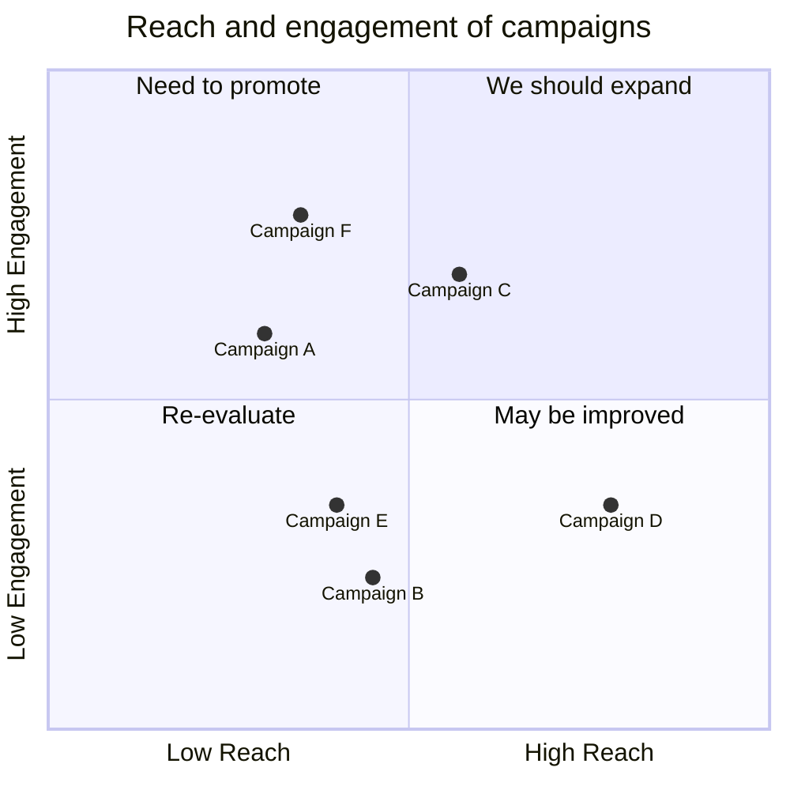

## Identificazione dei rischi

- [TECNICO] il team non ha esperienza nella progettazione e sviluppo di applicazioni con architettura a micro-servizi;
- [TECNICO] il team ha limitata esperienza riguardo l'utilizzo di tecnologie e strumenti per il _continuous depoloyment_ in ambienti di produzione;
- [ORGANIZZATIVO] rischio di sforare il budget;
- [ORGANIZZATIVO] vista la poca esperienza e altri progetti in corso provocare ritardi nella consegna;
- [ESTERNO] il sistema finale potrebbe avere meno _appeal_ rispetto a quello dei _competitor_ nel mercato.

## Assesment

`TODO`

Test mermaid:

Lorem ipsum...
