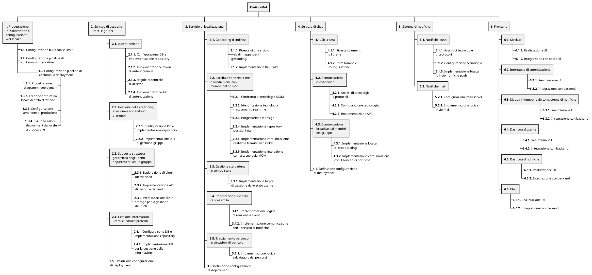

A partire dalla RBS definita nel [Allegato 2 - Requirements Breakdown Structure]({{ site.baseurl }}/attachments/2-rbs/), vengono qui di seguito esplosi i requisiti del sistema elencando le attività necessarie per soddisfarli, nel formato di una _Work Breakdown Structure_.

1. **Progettazione, inizializzazione e configurazione dei workspace con un adeguato _build tool_, di un'infrastruttura con predisposizione a una _pipeline_ automatizzata di _continuous integration & deployment_.**
   1. Configurazione build tool e DVCS
   2. Configurazione pipeline di _continuous integration_
   3. Configurazione pipeline di _continuous deployment_
      1. Progettazione diagrammi deployment
      2. Creazione struttura locale minimale di orchestrazione
      3. Configurazione ambiente di produzione
      4. Sviluppo azioni deployment da locale a produzione
   4. Configurazione _bot_ per aggiornamento automatico delle dipendenze
   5. Configurazione _bot_ per il _merge_ automatizzato di Pull Request sulla repo
   6. Configurazione _bot_ per il rilascio automatico delle _release_
   7. Configurazione di un sistema di _ticketing_ automatizzato

2. **Progettazione e implementazione di un servizio per la gestione utente.**
   1. Il sistema deve poter gestire l'autenticazione degli utenti
      1. Configurazione DB e implementazione repository
      2. Implementazione token di autenticazione
      3. Regole di controllo di accesso
      4. Implementazione API di autenticazione
   2. Il sistema deve poter gestire la creazione, adesione e abbandono ai gruppi (operazioni CRUD)
      1. Configurazione DB e implementazione repository
      2. Implementazione API di gestione gruppi
   3. Il sistema deve supportare una struttura gerarchica degli utenti appartenenti ad un gruppo
      1. Esplorazione di plugin _on the shelf_
      2. Implementazione API di gestione dei ruoli
      3. Predisposizione dello _storage_ per la gestione dei ruoli
   4. Il sistema deve poter gestire le informazioni relative agli utenti e l'impostazione degli indirizzi preferiti
      1. Configurazione DB e implementazione repository
      2. Implementazione API per la gestione delle informazioni
   5. Definizione configurazione di deployment

3. **Progettazione e implementazione di un servizio di localizzazione.**
   1. Il sistema deve effettuare il _geocoding_ di indirizzi e luoghi in coordinate
      1. Ricerca di un servizio web di mappe per il _geocoding_
      2. Implementazione ReST API
   2. Il sistema deve tracciare in tempo reale la posizione degli utenti e supportarne la condivisione con i membri del proprio gruppo
      1. Confronto di tecnologie _MOM_ consone allo sviluppo del servizio
      2. Identificazione della tecnologia che consenta un tracciamento _real-time_ reattivo e potenzialmente replicabile
      3. Progettazione e design
      4. Implementazione repository posizioni utenti
      5. Implementazione comunicazione _real-time_ tramite _websocket_
      6. Implementazione interazione con la tecnologia _MOM_ per la ricezione di eventi
   3. Il sistema deve gestire lo stato degli utenti in tempo reale
      1. Implementazione logica di gestione dello stato utente
   4. Il sistema deve permettere all'utente d'iniziare un percorso e condividerlo con i membri del proprio gruppo, notificando l'arrivo in prossimità della posizione di arrivo o in caso si verifichino situazioni anomale, quali: l'utente rimane fermo per troppo tempo nella stessa posizione, va _off-line_ o non ha raggiunto la destinazione entro un certo tempo stabilito all'atto della creazione del percorso;
      1. Implementazione logica di reazione a eventi
      2. Implementazione comunicazione con il servizio di notifiche
   5. Il sistema, al sollevarsi di una situazione di pericolo, deve tracciare il percorso compiuto fino alla sua cessazione
      1. Implementazione logica salvataggio dei percorsi
   6. Definizione configurazione di _deployment_

4. **Progettazione e implementazione di un servizio di chat.**
   1. Il sistema deve permettere una comunicazione sicura
      1. Ricerca strumenti o librerie che permettano di implementare una comunicazione criptata E2E
      2. Installazione e configurazione dello strumento scelto nel punto precedente.
   2. Il sistema deve permettere un canale di comunicazione tra il client e il server
      1. Analisi di tecnologie / protocolli per lo scambio di messaggi
      2. Configurazione tecnologia scelta per lo scambio di messaggi
      3. Implementazione API
   3. Il sistema deve permettere una comunicazione di natura broadcast ai membri appartenenti ai gruppi
      1. Implementazione logica di _broadcasting_ dei messaggi
      2. Implementazione comunicazione con il servizio di notifiche
   4. Definizione configurazione di _deployment_

5. **Sistema di notifiche**
   1. Il sistema deve permettere l'invio di notifiche push
      1. Analisi di tecnologie / protocolli per l'invio di notifiche _push_
      2. Configurazione tecnologia scelta
      3. Implementazione logica d'invio notifiche push
   2. Il sistema deve permettere l'invio di notifiche mail
      1. Configurazione mail server
      2. Implementazione logica invio mail
   3. Definizione configurazione di _deployment_

6. **Frontend**
   1. Realizzazione _mockup_ delle pagine
   2. Il sistema deve permettere di registrarsi e autenticarsi al sistema
      1. Realizzazione UI
      2. Integrazione con backend
   3. Il sistema deve mostrare all'utente la mappa in tempo reale e lo stato di tutti i gruppi di cui fa parte
      1. Realizzazione UI
      2. Integrazione con backend
   4. Il sistema deve permettere la modifica delle informazioni dell'utente
      1. Realizzazione UI
      2. Integrazione con backend
   5. Il sistema deve permettere di visualizzare le notifiche ricevute
      1. Realizzazione UI
      2. Integrazione con backend
   6. Il sistema deve permettere di visualizzare e interagire con le chat
      1. Realizzazione UI
      2. Integrazione con backend

