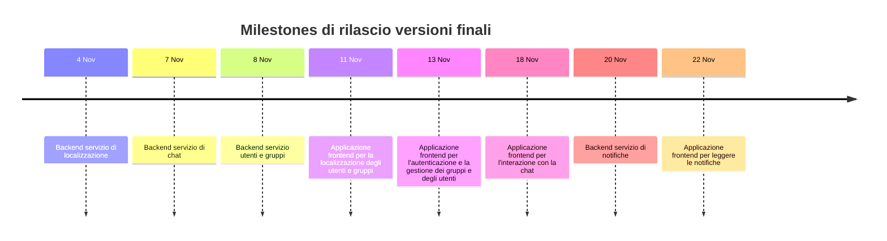

Il diagramma di Gantt con la pianificazione delle attività e le dipendenze temporali tra di esse è riportato di seguito.

> 📂 **_Nota_**
> La versione ingrandibile del diagramma di Gantt in formato pdf è disponibile [qui](https://raw.githubusercontent.com/position-pal/PM-report/refs/heads/main/res/gantt-colored.pdf).
{: .block-tip }

L'ultima attività di progetto è pianificata per il 22 Novembre 2024, a cui si aggiunge un periodo di _Contengency Reserve_ di circa 5 giorni per eventuali ritardi e imprevisti, pari al 10% della durata complessiva del progetto. 
La fine ultima del progetto è prevista entro il 28 Novembre 2024, in linea con le _Conditions of Satisfactions_ redatti in fase di definizione del progetto (vedi [Allegato 1 - Posizionamento]({{ site.baseurl }}/attachments/1-pos/)).

Per quanto concerne le _Milestone_, si prevede di rilasciare la versione finale dei vari sotto-sistemi in questo ordine:

