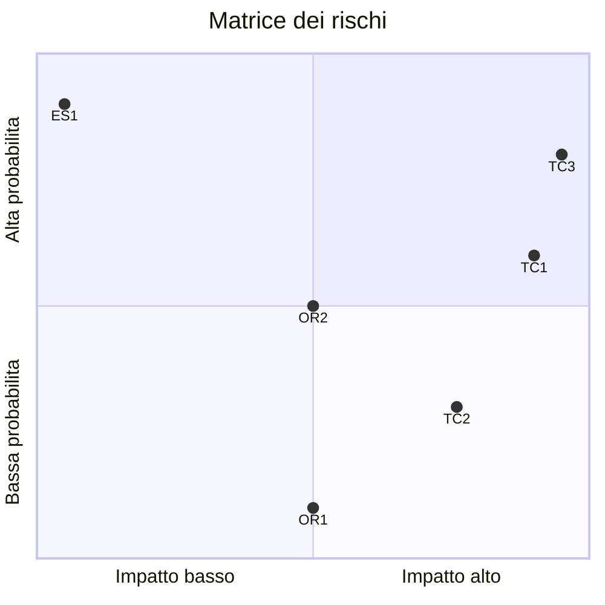

## Identificazione dei rischi

- **TECNICO**: il team non ha esperienza nella progettazione e sviluppo di applicazioni con architettura a micro-servizi;
- **TECNICO**: il progetto richiede l'utilizzo di tecnologie e strumenti sconosciuti ai membri del team di svliuppo;
- **TECNICO**: il team ha limitata esperienza riguardo l'utilizzo di tecnologie e strumenti per il _continuous depoloyment_ in ambienti di produzione;
- **ORGANIZZATIVO**: rischio di sforare il budget;
- **ORGANIZZATIVO**: vista la poca esperienza e altri progetti in corso provocare ritardi nella consegna;
- **ESTERNO**: il sistema finale potrebbe avere meno _appeal_ rispetto a quello dei _competitor_ nel mercato.

## Assessment

**Legenda**:

I livelli di impatto e priorità sono categorizzati in 4 livelli:

- B: Bassa
- M: Media
- A: Alta
- C: Critica

| Categoria di rischio | Scope | Evento # | Evento | Probabilità | Impatto | Priorità |
|---|---|---|---|---|---|----|
| TECNICO | Qualità | TC1 | Mancata qualità dovuta all'inesperienza del team di sviluppo | 0.6 | C | A |
| TECNICO | Qualità | TC2 | Le tecnologie CI/CD ritardano il rilascio in produzione | 0.3 | A | A |
| TECNICO | Qualità | TC3 | Il mal utilizzo delle tecnologie adottate provoca un deterioramento dei QoS (Quality of Services) | 0.8 | C | C |
| ORGANIZZATIVO | Budget | OR1 | Sforamento del budget | 0.1 | M | B |
| ORGANIZZATIVO | Budget | OR2 | Ritardi nella consegna | 0.5 | M | M |
| ESTERNO | Mercato | ES1 | Il sistema finale ha meno _appeal_ rispetto ai _competitor_ | 0.9 | B | B |

## Gestione dei rischi

| Evento # | Gestione | Descrizione |
|:----:|:---:|:---|
| TC1 | _Mitigate_ | Formazione del team sull'architettura a microservizi |
| TC2 | _Mitigate_ | Formazione del team sulle tecnologie CI/CD |
| TC3 | _Mitigate_   | Formazione del team sulle tecnologie presenti nel mercato |
| OR1 | _Accept_ | |
| OR2 | _Contingency Planning_ | In caso di ritardi le funzionalità opzionali vengono scartate |
| ES1 | _Accept_ | |
