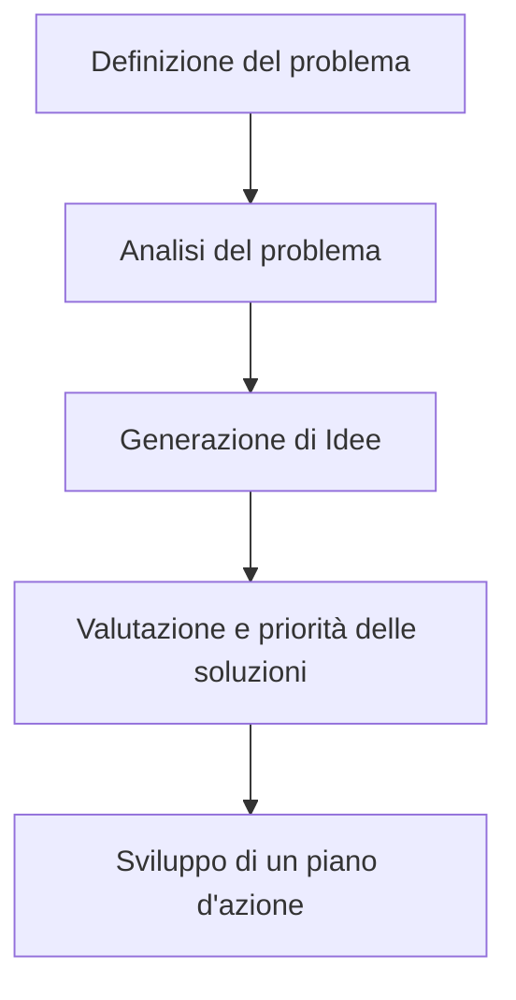

# Launching
Una volta definita la struttura, i requisiti e le attività necessarie per soddisfarli, il team è pronto a passare alla fase di _launching_ del progetto. 

## Kick-off meeting
Nel _kick-off meeting_ è stato possibile assegnare al team di sviluppo una roadmap chiara e definita, condividendo con tutti i membri del team i principali obiettivi del progetto, le scadenze e le aspettative del cliente.
Per la gestione dell'incontro è stata prodotta un'agenda operativa che ha comprende i seguenti punti:

- Introduzione con spiegazione degli obiettivi della riunione;
- Presentazione dello sponsor;
- Presentazione del team di sviluppo allo sponsor;
- Presentazione del progetto da parte del commitente;
- Presentazione della pianificazione da parte del project manager;
- Spiegazione delle regole operative del team;
- Sessione di Q&A;

## Matrice di assegnazione delle responsabilità

| Attività                        | Project Manager   | Luca Tassinari    | Luca Rubboli      | Giovanni Antonioni   |
|---------------------------------|-------------------|-------------------|-------------------|----------------------|
| 1. Avvio del progetto           | `Responsible`     | `Informed`        | `Informed`        | `Informed`           |
| 2. Configurazione dei workspace | `Informed`        | `Responsible`     | `Responsible`     | `Responsible`        |
| 3. Servizio utenti              | `Accountable`     | `Consulted`       | `Responsible`     | `Consulted`          |
| 4. Servizio localizzazione      | `Accountable`     | `Responsible`     | `Consulted`       | `Consulted`          |
| 5. Servizio chat                | `Accountable`     | `Consulted`       | `Consulted`       | `Responsible`        |
| 6. Servizio notifiche           | `Accountable`     | `Responsible`     | `Consulted`       | `Consulted`          |
| 7. Frontend                     | `Accountable`     | `Responsible`     | `Responsible`     | `Responsible`        | 
| 8. Lancio applicativo           | `Accountable`     | `Responsible`     | `Responsible`     | `Responsible`        |
| 9. Consegna progetto            | `Responsible`     | `Informed`        | `Informed`        | `Informed`           |

## Legend
- **Responsible (R):** Persona(e) responsabile dell’attività e del suo completamento consuccesso.
- **Accountable (A):** Persona(e) Incaricato dell’approvazione del risultato dell’attività.
- **Supporting (S):** Risorsa(e) assegnata per supportare il responsabile.
- **Consulted (C):** Persona(e) disponibile per assistere il responsible.
- **Informed (I):** Persona(e) membro che deve essere tenuto informato sullo stato di avanzamento.

## Regole operative per il team
Per garantire un corretto svolgimento delle attività e una comunicazione efficiente tra i membri del team, sono state definite le seguenti regole operative:

### Tools
**Task management**: La gestione delle attività deve essere eseguita utilizzando YouTrack, una piattaforma versatile per tracciare task, bug e milestone. Ogni attività del progetto viene creata e monitorata in tempo reale, fornendo al team una visione complessiva dello stato di avanzamento. Il tool è integrato con GitHub e altri strumenti, consentendo una sincronizzazione continua tra sviluppo e gestione del progetto.

**Version control**: Il controllo del codice sorgente deve essere gestito tramite Git, seguendo un modello di branching strutturato come Git Flow. Tutte le modifiche apportate al codice devono essere tracciate, consentendo al team di lavorare simultaneamente su più funzionalità e gestire revisioni del codice tramite pull request su GitHub. Git garantisce la registrazione di ogni modifica, offrendo la possibilità di ripristinare versioni precedenti in caso di necessità, e le pipeline di Continuous Integration (CI) assicurano che ogni push venga testato automaticamente per mantenere la qualità del codice.

**Comunicazioni**: Per le comunicazioni interne, deve essere utilizzato Microsoft Teams, che permette di gestire videoconferenze, chat e condivisione di file. Riunioni settimanali e aggiornamenti quotidiani vengono condotti su Teams, mantenendo il team allineato sugli sviluppi del progetto. Teams supporta l'uso di chat tematiche e canali dedicati a specifiche aree di lavoro, facilitando il flusso di informazioni e migliorando la collaborazione, riducendo i tempi di risposta e assicurando un coordinamento efficace.

### Meetings

Il team adotta il framework Scrum per gestire i meeting e mantenere un ritmo costante di lavoro. Ogni incontro segue regole precise per garantire una comunicazione efficace e una collaborazione fluida tra i membri del gruppo. Le principali riunioni che devono essere condotte sono:

**Daily Stand-up (Daily Scrum)**: Ogni giorno, si tiene un breve incontro di 15 minuti, durante il quale ciascun membro del team condivide tre punti chiave: cosa ha fatto il giorno precedente, cosa intende fare durante la giornata e se ci sono eventuali ostacoli che potrebbero impedire il progresso. 

**Sprint Planning**: All'inizio di ogni sprint, si organizza una sessione di Sprint Planning. In questo incontro, il Product Owner presenta le priorità e gli obiettivi da raggiungere, mentre il team esamina le user stories e suddivide il lavoro in task chiari e gestibili. L’obiettivo è assicurarsi che tutte le attività siano ben comprese, definite e stimate in base alla capacità disponibile del team per lo sprint.s

**Sprint Review**: Al termine di ogni sprint, si tiene lo Sprint Review, in cui il team presenta il lavoro completato al Product Owner e agli stakeholder. Durante questa riunione, le funzionalità sviluppate vengono mostrate sotto forma di demo, e si raccolgono feedback utili per migliorare le iterazioni successive. L'incontro garantisce trasparenza sul progresso e permette di adattare il progetto in base alle nuove esigenze.

## Problem solving

Il team adotta un approccio collaborativo per risolvere i problemi basato sulla regola dei 5 punti di Daniel Couger:

1. **Definizione del problema**: In questa fase viene definito in maniera formale il problema assieme al proprietario di questo.

2. **Analisi del problema**: Il team deve analizzare il problema per identificare le cause principali. È fondamentale esplorare tutte le possibili ragioni che hanno portato al problema, considerando ogni possibile variabile a riguardo.

3. **Generazione di Idee**: Durante questa fase, il team è incoraggiato a proporre un'ampia gamma di soluzioni senza limitarsi a un'unica opzione. Tutte le idee devono essere accolte e discusse.

4. **Valutazione e priorità delle soluzioni**: Una volta raccolte tutte le idee, il team deve valutare e confrontare le soluzioni proposte per determinare quale sia la più efficace e realizzabile. Le soluzioni vengono valutate in base a criteri specifici e priorizzate in base alla loro rilevanza e fattibilità.

5. **Sviluppo di un piano d'azione**: Infine, il team sviluppa un piano d'azione dettagliato per implementare la soluzione scelta. Il piano deve includere una descrizione chiara delle attività necessarie, delle risorse coinvolte e delle tempistiche previste per il completamento.

## Gestione cambiamenti scope

Nel caso in cui si rendesse necessario apportare modifiche allo scope del progetto, il team adotta un processo strutturato per gestire i cambiamenti in modo efficace e trasparente il quale prevede le seguenti fasi:

1. **Formalizzazione della richiesta**: Il cambiamento deve essere formalizzato attraverso una richiesta scritta che descriva in modo chiaro e dettagliato la natura della modifica richiesta. Questa deve essere presentata al Project Manager tramite l'invio di una mail.

2. **Analisi preliminare**: Il Project Manager valuta la richiesta di cambiamento e ne analizza l'impatto sul progetto in termini di costi, tempi e risorse. In base a questa valutazione, il PM decide se approvare o respingere la richiesta.

3. **Decision Making Meeting**: Se la richiesta di cambiamento viene approvata, si tiene un incontro con il team per discutere le implicazioni del cambiamento e definire un piano d'azione per implementarlo. Durante l'incontro vengono assegnate le nuove attività e si stabiliscono le nuove scadenze.

4. **Aggiornamento del piano**: Una volta approvato il cambiamento, il Project Manager aggiorna il piano di progetto e comunica le modifiche a tutti i membri del team.
